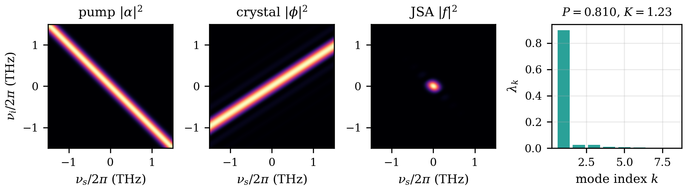

# 2. النموذج والطرق

## السعة الطيفية المشتركة

ننظر في التحويل الوسيطي التلقائي النازل (SPDC) المسامت (collinear) أحادي النمط المكاني، ونصف زوج الفوتونات (photon pair) المنبعث بسعته الطيفية المشتركة (Joint Spectral Amplitude, JSA). وإذا رمزنا بـ $\nu_s$ و$\nu_i$ للانحرافين التردديين (detunings) بالتردد الزاوي لفوتونَي الإشارة (signal) والعاطل (idler) عن ترددَيهما المركزيين التصميميين، فإن JSA تتحلل إلى حاصل ضرب حدٍّ لحفظ الطاقة (energy conservation) يحدده الضخ (pump) وحدٍّ لحفظ الزخم (momentum conservation) تحدده البلورة اللاخطية (nonlinear crystal) [3]:

$$ f(\nu_s,\nu_i) = \alpha(\nu_s+\nu_i)\,\phi(\nu_s,\nu_i) \qquad (1) $$

فلضخٍّ غاوسي محدود التحويل (transform-limited) يكون الغلاف هو $\alpha(\nu) = \exp[-\nu^2/(2\sigma^2)]$، وهو شريط ممتد على طول القطر المضاد $\nu_s+\nu_i=0$؛ حيث $\sigma$ هو الانحراف المعياري لغلاف السعة بالتردد الزاوي. وتُذكر عروض النطاق في هذه الورقة كلها بقيمها المقابلة بالتردد العادي؛ ولضخّ المرجع $\sigma/2\pi = 0.164$ THz. أما مطابقة الطور (phase matching) فنستخدم لها المفكوك القياسي من الرتبة الأولى، بدلالة عدم تطابق السرعة الزمرية (Group-Velocity Mismatch, GVM)، لعدم تطابق متجه الموجة في بلورة طولها $L$:

$$ \phi(\nu_s,\nu_i) = \mathrm{sinc}\!\left(\frac{\Delta k\,L}{2}\right), \qquad \Delta k = \kappa_s \nu_s + \kappa_i \nu_i \qquad (2) $$

حيث $\mathrm{sinc}(x)=\sin(x)/x$، و$\kappa_j = 1/v_g^{\mathrm{pump}} - 1/v_g^{(j)}$ هو عدم تطابق السرعة الزمرية بين الضخ والفوتون $j$. وللبلورة المرجعية $L = 10$ mm و$\kappa_s = +0.207$ ns/m و$\kappa_i = -0.318$ ns/m، وهي قيم ممثِّلة لبلورة KTP دورية الأقطاب (PPKTP) مضخوخة عند 775 nm ومنتجة أزواجًا متساوية التردد (degenerate) عند 1550 nm [3, 5, 8]. وتحدد النسبة $\kappa_s/\kappa_i$ ميلَ حافة sinc في المستوى $(\nu_s,\nu_i)$، ويقرر تفاعلُ هذا الميل مع شريط الضخ مدى قابلية JSA للفصل (separable) (الشكل 1). ونقتصر عمدًا على هذا النموذج من الرتبة الأولى: فلا تشتُّتَ بمعادلات سلمايِر (Sellmeier)، ولا حدودَ من رتب أعلى، ولا تلطيف (apodization) للاّخطية [7, 8]، حتى تعزل ميزانياتُ العيوب (imperfection budgets) الآتية أدناه آثارَ الضخ وحدها عند هندسة مطابقة طور ثابتة وشفافة.

**الشكل 1:** تشريح JSA عند النقطة المرجعية ($L = 10$ mm، $\sigma/2\pi = 0.164$ THz)؛ المحاور هي الانحرافات الترددية $\nu/2\pi$ بوحدة THz. من اليسار إلى اليمين: شدة الضخ $|\alpha|^2$، وهي شريط على امتداد القطر المضاد $\nu_s+\nu_i=0$ (حفظ الطاقة)؛ ثم شدة مطابقة الطور $|\phi|^2$، وهي حافة sinc ذات فصوص جانبية يحدد ميلَها $\kappa_s/\kappa_i$ (حفظ الزخم)؛ ثم حاصل ضربهما، أي الشدة الطيفية المشتركة (JSI) $|f|^2$، وهي فص مركزي مُدمج شبه متماثل المناحي مع فصوص sinc جانبية باهتة؛ وأخيرًا طيف شميت $\lambda_k$ للسعة المقطَّعة عدديًا، يهيمن عليه معامل واحد ويعطي $P = 0.810$ و$K = 1.23$.

## تحليل شميت

تُحسب JSA على شبكة (grid) مربعة من $n$ نقطة على كل محور فوق نافذة نصف عرضها 4–8 THz (تُختار لكل دراسة بحيث تتلاشى الشدة إلى الصفر قبل الحدود بمسافة وافية)، وتُطبَّع بحيث $\sum |f|^2 = 1$. وتحليل شميت (Schmidt decomposition) لـ JSA المقطَّعة عدديًا هو تحليل قيمها المفردة (Singular Value Decomposition, SVD) [4]: فبقيم مفردة $s_k$ تكون معاملات شميت هي $\lambda_k = s_k^2 / \sum_j s_j^2$، ويكون النقاء الطيفي (spectral purity) للفوتون المُبشَّر به (heralded) وعدد شميت (Schmidt number):

$$ P = \sum_k \lambda_k^2 , \qquad K = 1/P \qquad (3) $$

وتقابل القيمة $P = 1$ ($K = 1$) سعةً طيفية مشتركة قابلة للفصل تمامًا. وعند النقطة المرجعية $P = 0.8100$ ($K = 1.2345$).

## الضخ المعيب كحشد حالة مختلطة

الضخ المعيب هو حشد إحصائي (ensemble) كلاسيكي من تحقيقات (realizations) ضخٍّ نقية، ولذلك يوصف فوتون الإشارة المُبشَّر به بمصفوفة كثافة (density matrix) لا بطيف شميت واحد. فنُجري معاينة مونتي كارلو (Monte-Carlo) لعدد $N$ من التحقيقات النقية عند كل نقطة من نقاط المسح (sweep) ($N = 120$ في المسوح القياسية، و$N = 240$ في دراسة الرجرجة ذات الميز الدقيق، و$N = 1000$ في مسح RIN الذي تكون كلفة التحقيق الواحد فيه أدنى)، ونحسب مصفوفة JSA المقطَّعة عدديًا $A_k$ لكل تحقيق، ثم نراكم:

$$ \rho \propto \sum_{k} w_k\, A_k A_k^\dagger \qquad (4) $$

ومنها يُستخرج نقاء الفوتون المُبشَّر به في صيغة مستقلة عن التطبيع:

$$ P = \frac{\mathrm{Tr}(\rho^2)}{[\mathrm{Tr}(\rho)]^2} \qquad (5) $$

ويُعبَّر عن كل عيب مباشرةً ببارامترات مأخوذة من إحصاءات ورقة بيانات (datasheet) الليزر، ولا يدخل العيب إلا في الضخ وحده. ونعاين لكل تحقيق ما يلي: (1) *رجرجة/انجراف المركز* (center jitter/drift) — إزاحة غاوسية لتردد مركز الضخ بقيمة جذر متوسط المربعات (rms) المذكورة في المواصفات، تُعامَل بوصفها حشدًا شبه ساكن (quasi-static) ضخةً بعد ضخة.

ولهذه المعالجة شبه الساكنة نطاق صلاحية محدد. فالضخ *نبضي*: إذ يقابل $\sigma/2\pi = 0.164$ THz نبضاتٍ من رتبة البيكوثانية، وRIN في هذا النموذج هو ضجيج طاقة النبضة (pulse energy noise). وتصح صورة الحشد لعمليات الضجيج الأبطأ من زمن تماسك (coherence time) الضخ، $\tau_{\mathrm{coh}} \sim 1/\sigma \approx 1$ ps، بحيث يرى كل زوج مركزَ ضخ ساكنًا، والأسرع من زمن التكامل، بحيث يُعايَن الحشد معاينةً كاملة. ولمصدر من رتبة 80 MHz يُكامَل على مدى ثوانٍ تمتد هذه النافذة على ترددات ضجيج من نحو Hz إلى عشرات GHz، فتغطي العمليات المختبرية المهيمنة — الانجراف الحراري، والاهتزازات الصوتية واهتزازات الحوامل، وضجيج تيار التشغيل. أما مركّبات الضجيج دون البيكوثانية فتؤثر تأثيرًا متماسكًا في كل JSA نقية على حدة، وتقع خارج حدود النموذج.

‏(2) *البنية متعددة الأنماط الطولية* (longitudinal modes) — خط واحد من المشط الترددي (frequency comb) يُسحب من مجموعة من $M$ خطًا متقطعًا متمركزة تناظريًا حول الضخ، عند إزاحات تساوي $(m - (M-1)/2)$ مضروبةً في تباعد الأنماط (mode spacing) لأجل $m = 0,\dots,M-1$ (مضاعفات نصف صحيحة للتباعد عندما يكون $M$ زوجيًا)، بأوزان خطوط مطبَّعة (منتظمة ما لم يُذكر غير ذلك)؛ وتكون إزاحة الضخ الكلية مجموعَ إزاحة خط المشط وسحبة الرجرجة. وسحبُ خط واحد لكل تحقيق يفترض أن الأنماط الطولية غير متماسكة فيما بينها — وهو الوصف الصحيح لدايود متعدد الأنماط حر الجريان، تحمل أنماطه أطوارًا نسبية عشوائية ويُظهر ضجيج توزُّع الأنماط (mode-partition noise). لكنه ليس الوصف الصحيح لمشط مقفول الأنماط (mode-locked) متماسك الطور: فهناك تكون JSA مجموعًا متماسكًا على الخطوط — أي حالة نقية لا خليطًا — كما أن أسنان المشط، المتباعدة بمعدل تكرار من رتبة 80 MHz، أدقّ بكثير على أي حال من أن تحلّها JSA.

‏(3) *ضجيج الشدة النسبي* (RIN) — وزنُ تحقيقٍ $w = \max[0,\, 1 + \mathcal{N}(0, r^2)]$، حيث $\mathcal{N}(0, r^2)$ توزيع غاوسي صفري المتوسط انحرافه المعياري $r$، وهو قيمة rms الكسرية لضجيج الشدة، مع تطبيع JSA لكل تحقيق على حدة.

ويُشغَّل كل مسح مونتي كارلو وراء الأشكال وميزانيات الجدول II بعدد $S = 16$ بذرة (seed) مستقلة (أما مسح RIN، الذي يكون نقاؤه المُبشَّر به مستقلًا تمامًا عن الأوزان المُعايَنة — انظر طقم التحقق أدناه — فيستخدم $S = 8$). وتستخدم فحوص التقارب المساعدة — نسخُ تنعيم الشبكة أحاديةُ البذرة الموصوفة أدناه، وفحصُ مضاعفة $N$ ذو البذور الثماني لميزانيات الرجرجة — عددًا أقل من البذور. ويسحب كل زوج (بذرة، نقطة) تحقيقاتِه الـ$N$ من مجرى عشوائي مستقل مُبذَّر بالزوج نفسه؛ إذ إن تبذير المجاري بمجموع رقم البذرة ودليل النقطة كان سيجعل النسخ تتداخل (فتعيد البذرة $s+1$ عند نقطة المسح $i$ إنتاجَ البذرة $s$ عند النقطة $i+1$)، ومن ثم يجعل نسخًا مستقلة اسميًا مترابطةً فعليًا. والمنحنيات المعروضة هي متوسطات على المنحنيات الـ$S$ الخاصة بالبذور، وتُذكر ميزانيات العيوب في الجدول II بوصفها المتوسط ± الخطأ المعياري للمتوسط (SEM) محسوبًا على عبورات العتبة الخاصة بكل بذرة.

## المعيار المغلق: النموذج الغاوسي المزدوج

يمكن فحص آلية مونتي كارلو في مواجهة الرياضيات لا في مواجهة نفسها. فاستبدال دالة مطابقة طور غاوسية بدالة sinc في المعادلة (2) [3, 8]:

$$ \phi_G(\nu_s,\nu_i) = \exp\!\left[-\gamma \left(\frac{\Delta k\, L}{2}\right)^{\!2}\right], \qquad \gamma = 0.193 \qquad (6) $$

يجعل JSA دالةً غاوسية ثنائية البعد، ويجعل كل كمية ذات أهمية قابلةً للحساب تحليليًا. وتُثبَّت قيمة $\gamma$ بمطابقة منتصف قمة *السعة* لدالة sinc: فالدالتان تساويان $1/2$ عند $x = 1.8955$. ولاحظ أنه لما كانت سعة البلورة $\exp(-\gamma x^2)$ فإن الانحناء الداخل في الصيغة التربيعية أدناه هو $2\gamma$. وبوضع $a_j = \kappa_j L/2$ تكون JSA هي $f_G \propto \exp\{-\tfrac{1}{2}[A\nu_s^2 + 2C\nu_s\nu_i + B\nu_i^2]\}$ حيث

$$ A = \frac{1}{\sigma^2} + 2\gamma a_s^2 , \qquad B = \frac{1}{\sigma^2} + 2\gamma a_i^2 , \qquad C = \frac{1}{\sigma^2} + 2\gamma a_s a_i , $$

ويعطي أخذُ الأثر الجزئي على أحد الفوتونين نقاءَ الحالة النقية (pure state) في صيغة مغلقة (closed form):

$$ P_0 = \sqrt{1 - \frac{C^2}{A B}} \qquad (7) $$

ولرجرجة مركزٍ غاوسية قيمتها rms تساوي $J$ (بالتردد العادي Hz) ينغلق أيضًا النقاء المختلط في المعادلة (5):

$$ P(J) = \frac{P_0}{\sqrt{1 + 4 c\,(2\pi J)^2}} , \qquad c = \frac{1}{2\sigma^2 + 1/(\gamma a_s^2)} \qquad (8) $$

وفي هذا الاشتقاق ثلاث نقاط يسهل الخطأ فيها. أولاها أن الحد التقاطعي اللازم لحساب $\mathrm{Tr}(\rho^2)$ هو $\mathrm{Tr}(A A^\dagger A' A'^\dagger) = \| A^\dagger A' \|_F^2$، لا تراكُب الفوتونين $|\langle f | f' \rangle|^2$، فهذا الأخير هو نقاء حالة *الفوتونين* المختلطة — وهي كمية مختلفة. وثانيتها أن الحالات المختزلة المختلطة *غير متناظرة* بين الإشارة والعاطل: فالثابت $c$ يحمل ثابت GVM للفوتون *الذي أُخذ عليه الأثر*، ولما كانت $\rho$ عندنا في المعادلة (4) تُبقي على العاطل، فإن $c$ يحتوي $a_s$. وثالثتها أن إزاحة مركز الضخ انسحابٌ صلب تام لـ JSA، ولذلك يكون التطبيع لكل تحقيق تامًا ويكون معدل الأزواج (pair rate) مستقلًا عن الرجرجة في هذا النموذج. وعند النقطة المرجعية تعطي المعادلة (7) القيمة $P_0 = 0.9818$ — وهي أكثر قابليةً للفصل جوهريًا من نموذج sinc ذي القيمة $P = 0.8100$ الذي تحمل فصوصه الجانبية تشابكًا (entanglement) — وتتحقق القابلية التامة للفصل ($C = 0$، $P_0 = 1$) عند عرض نطاق ضخ قدره 0.1997 THz، وهو أمر ممكن لأن $\kappa_s \kappa_i < 0$. ويستخدم القسم 3 المعادلتين (7) و(8) بوصفهما تحققًا خارجيًا من خط أنابيب مونتي كارلو الكامل (الشكل 4).

## من وحدات ورقة البيانات إلى بارامترات النموذج

ينشر المصنّعون العروض الطيفية بوحدات MHz أو nm، والاستقرارات بوحدات pm أو pm/K، وRIN كثافةً طيفية بوحدة dB/Hz، وهندسة التجويف بوحدة mm — ولا يقبل النموذج أيًا منها مباشرة. لذلك جُعلت طبقة الترجمة صريحةً عن قصد؛ إذ يحمل كل تحويل افتراضًا فيزيائيًا واحدًا مصرَّحًا به. فالعرض الكامل عند منتصف القمة (FWHM) لطيف شدةٍ غاوسي $\Delta\nu_{\mathrm{FWHM}}$ يُحوَّل إلى عرض نطاق النموذج (الانحراف المعياري لغلاف السعة) وفق:

$$ \frac{\sigma}{2\pi} = \frac{\Delta\nu_{\mathrm{FWHM}}}{2\sqrt{\ln 2}} \qquad (9) $$

وتُحوَّل انزياحات الطول الموجي عند الرتبة الأولى عبر:

$$ \delta\nu = \frac{c\,\delta\lambda}{\lambda^2} \qquad (10) $$

أي 499.1 GHz لكل nm عند $\lambda = 775$ nm. ومواصفة الانجراف (drift) المحدود ("$\pm a$ على مدى $T$ ساعة"، أو معامل pm/K مضروبًا في استقرار حراري) تعرّف شريط انزياح من القمة إلى القمة $\mathrm{pp} = 2a$ لا توزيعًا غاوسيًا؛ وباعتبار المركز موزعًا توزيعًا منتظمًا على الشريط نحصل على:

$$ \mathrm{rms} = \frac{\mathrm{pp}}{2\sqrt{3}} \qquad (11) $$

وكثافة RIN الطيفية، إذا افتُرضت بيضاء على عرض نطاق التجميع $B$ (مقلوب بوابة الكشف أو دور النبضة)، تتكامل إلى قيمة rms الكسرية:

$$ r = \left[ 10^{\mathrm{RIN}/10}\, B \right]^{1/2} \qquad (12) $$

ولتجويف ليزر ذي موجة موقوفة طوله $L_{\mathrm{cav}}$ ومعامل انكساره $n$ يكون تباعد الأنماط الطولية، أي المدى الطيفي الحر (FSR):

$$ \mathrm{FSR} = \frac{c}{2 n L_{\mathrm{cav}}} \qquad (13) $$

وهو ما يُسقَط على تباعد المشط في النموذج متعدد الأنماط.

على أن رقمًا واحدًا من الأرقام المنشورة يستحق تنبيهًا لا تحويلًا: فعرض الخط (linewidth) اللورنتزي ينشأ من انتشار طور سريع وليس له عزم ثانٍ منتهٍ، فلا وجود لقيمة rms له ولا يصفه الحشد شبه الساكن — إذ إن ضجيج الطور الذي يفقد ترابطه داخل النبضة الواحدة لا يزيح شريط الضخ إزاحة صلبة. لذلك لا نستخدم نصف العرض عند منتصف القمة (HWHM) اللورنتزي إلا حدًّا بديلًا متحفظًا عن عمدٍ على رجرجة المركز؛ ولعروض الخط من رتبة MHz في دايودات ليزر التغذية الراجعة الموزعة (DFB) يقع هذا الحد أدنى بمراتب عشرية من ميزانيات الجدول II ذات مقياس GHz فيكون مهملًا. أما مواصفات الانجراف الترددي البطيء ($\pm$pm على مدى ساعات، أو pm/K مضروبًا في استقرار حراري) فهي شبه ساكنة *فعلًا*، وتدخل عبر المعادلتين (10) و(11). وتُطبَّق هذه التحويلات على منتجات حقيقية في الجدول III.

## المتانة العددية والتحقق

تستخدم مسوحُ الضخ المثالي $n = 512$؛ وتستخدم دراسات مونتي كارلو $n = 256$، وهي قيمة متقاربة إلى أفضل من $10^{-4}$ في $P$ مقارنةً بـ$n = 768$ عند أصعب نقاط مسوح البارامترات (عرض نطاق 0.05 THz على نافذة نصف عرضها 6 THz؛ وبلورة 2 mm على نافذة نصف عرضها 8 THz). ويستخدم مسح RIN شبكة أخشن $n = 64$: فهناك تتشارك التحقيقات كلها JSA متطابقة ولا تتغير إلا الأوزان السلّمية، ولذلك يكون ثباتُ النقاء المذكور تامًا عند أي حجم شبكة. ولا تُزيح النسخُ أحادية البذرة من مسح رجرجة بلورة 10 mm عند $n = 128$ و$n = 192$ النقاءَ المختلط إلا بنحو $\sim 2\times10^{-5}$، وهو أدنى بكثير من التشتت بين البذور في مونتي كارلو: أي إن ضجيج المعاينة، لا التقطيع العددي، هو المهيمن على ميزانية الخطأ. ويأتي الكود مزوَّدًا بطقم تحقق (validation suite) من أربعة عشر اختبارًا فيزيائيًا، منها: الانهيار التام لحشد العيوب الصفرية إلى نقاء الحالة النقية بتحليل SVD ($P = 0.8100$)، والثبات التام للنقاء المُبشَّر به تجاه RIN (فرق أدنى من $10^{-9}$)، واختزال مشطٍ وزنُ خطوطه الجانبية صفرٌ إلى نتيجة النمط الواحد، والتدهور الرتيب للنقاء مع الرجرجة، ومعايير مرجعية بصيغ مغلقة في مواجهة النموذج الغاوسي المزدوج: إذ يطابق نقاء SVD المعادلةَ (7) إلى أفضل من $10^{-4}$، ويعيد خط أنابيب مونتي كارلو الكامل إنتاج المعادلة (8) بما في ذلك انحياز مقدِّرها عند $N$ المحدود.

وتستخدم جميع عمليات المحاكاة حزمة `qsource-sim` مفتوحة المصدر (Python، رخصة MIT)، المتاحة على https://github.com/ABD252/qsource-sim؛ وسيرافق التقديمَ معرّفُ كائن رقمي (DOI) من زينودو (Zenodo). ويُعاد توليد كل شكل وجدول في هذه الورقة من ملف إعداد YAML تصريحي، بواقع ملف واحد لكل دراسة.

