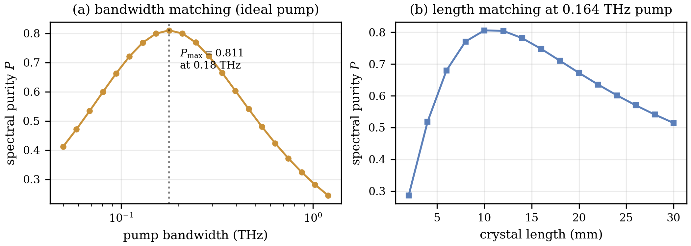
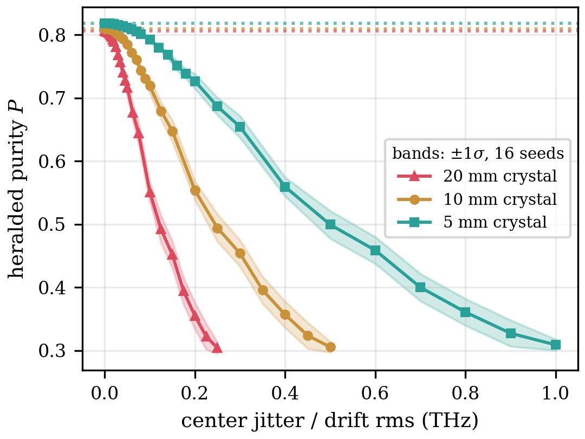
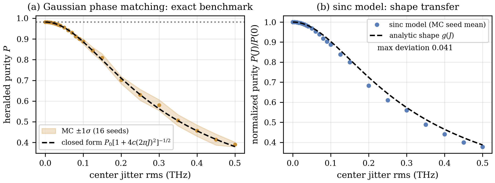
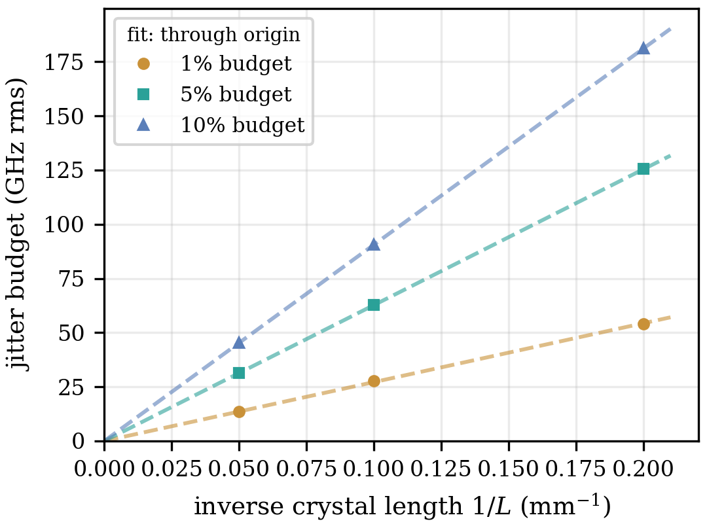
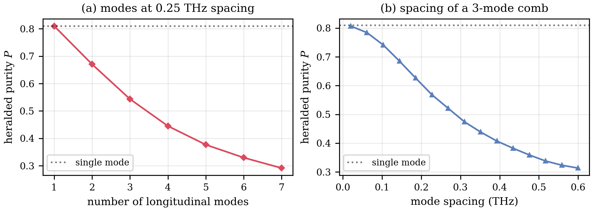
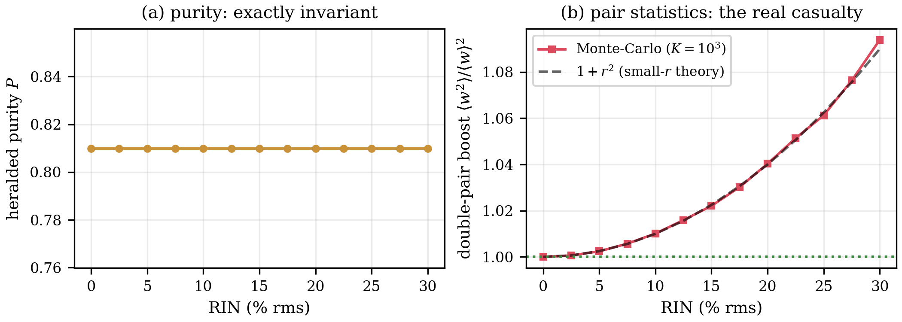

# 3. النتائج

## 3.1 خط الأساس للمصدر المثالي

نبدأ بإرساء خط الأساس للضخ (pump) المثالي الذي تُنسَب إليه جميع ميزانيات العيوب (imperfection budget). يعرض الشكل 2(أ) نقاء الفوتون المُبشَّر به (heralded purity) وفق المعادلة (5) بوصفه دالةً في عرض نطاق الضخ (pump bandwidth) للبلورة المرجعية ذات الطول 10 mm. وللمنحنى القمة الداخلية العريضة المتوقعة عندما يتوازن ترابطا غلاف الضخ ومطابقة الطور (phase matching) في المعادلة (1) [3, 4, 6]: فالقمة المحدودة بالشبكة (grid) هي $P_{\max} = 0.8106$ عند $0.178$ THz على شبكة المسح (sweep) ($n = 512$، بنصف نافذة ترددية قدرها 6 THz)، والقمة مسطحة، وتعطي النقطة المرجعية المعيارية $\sigma = 0.164$ THz قيمة $P = 0.8100$ على الشبكة المرجعية ($n = 256$، نصف نافذة 4 THz) المستخدمة في جميع دراسات مونتي كارلو (Monte-Carlo) أدناه. وتمتد نافذة السماحية (tolerance) عند 1% من 0.159 إلى 0.202 THz، ومن ثمّ فإن عرض النطاق نفسه بارامتر تصميمي متسامح. والانحدار متناظر لوغاريتميًا تقريبًا حول القمة المثلى: فالعوامل المتساوية بُعدًا عن القمة تعطي قيم نقاء متقاربة (مثلًا $P = 0.663$ و$0.665$ عند عامل $1.9$ تحت القمة وفوقها)، ولا تختلف قيمتا الطرفين — $P = 0.41$ عند $0.05$ THz مقابل $0.24$ عند $1.2$ THz — إلا لأن المسح يمتد أبعد في جهة النطاق العريض (بعاملَي $3.6$ و$6.7$ عن القمة على الترتيب). أما الفجوة المتبقية دون $P = 1$ فهي الثمن المألوف لدالة مطابقة الطور من نوع sinc غير المُلطَّفة (unapodized) [7, 8]. ويعرض الشكل 2(ب) المسح المكمّل: عند تثبيت $\sigma = 0.164$ THz يبلغ طول البلورة قيمته المثلى عند 10–12 mm ‏($P = 0.806$ عند 10 mm و$0.805$ عند 12 mm)، منخفضًا إلى $0.286$ عند 2 mm و$0.51$ عند 30 mm. وهذا هو شرط المطابقة نفسه منظورًا إليه من جهة البلورة. والإزاحة الصغيرة بين القيمة $0.806$ المذكورة هنا والقيمة المرجعية $0.8100$ أعلاه أثرٌ من بَتر النافذة الترددية (window truncation) لا من التقطيع العددي (discretization): فالفصوص الجانبية لدالة sinc البطيئة التلاشي تجعل النقاء المحسوب ينجرف مع نصف عرض النافذة ($P = 0.8100$ و$0.8074$ و$0.8061$ عند نقطة التشغيل نفسها لأنصاف النوافذ 4 و6 و8 THz الخاصة بالشبكة المرجعية ومسح عرض النطاق ومسح الطول على الترتيب)، ومن ثم لا تُقارَن قيم النقاء المثالي إلا داخل نافذة ثابتة، وهي لا تستقل عن النافذة إلا عند المستوى $P \approx 0.81$. وكمرساة في النطاق الضيق، يعطي ضخٌّ بعرض 5 GHz القيمتين $P = 0.044$ وعدد شميت $K = 22.6$ (المعادلة (3)) متى حلّت الشبكةُ حافةَ الضخ ذات بضعة GHz (وهي أضيق من بكسل شبكات المسح)، مستعيدًا نهاية الوضع شبه المستمر (quasi-CW) شديد الترابط الطيفي العكسي.

**الشكل 2:** فضاء التصميم للمصدر المثالي. (أ) نقاء الفوتون المُبشَّر به مقابل عرض نطاق الضخ (محور لوغاريتمي) للبلورة ذات 10 mm؛ يشير الخط المنقّط إلى القمة المحدودة بالشبكة $P_{\max} = 0.8106$ عند $0.178$ THz فوق قمة مثلى مسطحة. (ب) النقاء مقابل طول البلورة (2–30 mm) عند عرض نطاق الضخ المرجعي الثابت $0.164$ THz، مع القيمة المثلى عند 10–12 mm.

## 3.2 الانجراف الطيفي والرجرجة

يعرض الشكل 3 نقاء الفوتون المُبشَّر به للحالة المختلطة (mixed state) الناتجة من مونتي كارلو (المعادلة (4)) في أثناء رجرجة التردد المركزي (center-frequency jitter) للضخ بسعة rms متزايدة، لثلاثة مصادر مُطابَقة الطول. فعند رجرجة صفرية يستعيد كل حشد إحصائي (ensemble) قيمته المثالية بدقة ($P(0) = 0.8100$ للمرجع ذي 10 mm)، ويكون تدهور متوسط البذور رتيبًا على امتداد المسح. والأحزمة المظللة هي التشتت $\pm 1\sigma$ على $S = 16$ بذرة (seed) مستقلة ($N = 120$ تحقيقًا (realization) لكل بذرة ونقطة مسح)؛ ويهيمن هذا التشتت بين البذور على خطأ التقطيع المهمَل ($\sim 2\times 10^{-5}$ عند تنعيم الشبكة مع نافذة ثابتة). وبتدوين كل ميزانية بوصفها المتوسط ± الخطأ المعياري لعبورات العتبة (threshold crossings) لكل بذرة، تتحمل البلورة المرجعية ذات 10 mm رجرجةَ مركزٍ قدرها $27.7 \pm 0.3$ و$62.7 \pm 0.7$ و$91 \pm 1$ GHz ‏(rms) لانخفاض نسبي في النقاء قدره 1/5/10% (وبالتعبير عن الطول الموجي، تكافئ $27.7$ GHz عند 775 nm ما مقداره $55.5$ pm). وتأتي خانة 1% من مسح دقيق مخصص (بخطوات 5 GHz حول نقطة العبور، $N = 240$)؛ ويجد فحص للتقارب في $N$ على مسح 10 mm أن $|b(N{=}240) - b(N{=}120)| < 2\,\mathrm{SEM}$ عند كل مستوى انخفاض، فتبقى الميزانيات دون تغيّر ضمن أشرطة الخطأ عند مضاعفة $N$. وإعادة مطابقة المصدر ببلورة 5 mm وضخّ $0.328$ THz (نقاء مثالي $P = 0.8183$) تضاعف كل ميزانية تقريبًا، إلى $54.1 \pm 0.9$ و$125 \pm 1$ و$181 \pm 3$ GHz، بينما بلورة 20 mm مُطابَقة لضخّ $0.082$ THz (نقاء مثالي $P = 0.8061$) تُنصِّفها تقريبًا، إلى $13.5 \pm 0.2$ و$31.3 \pm 0.4$ و$45.3 \pm 0.6$ GHz: ذلك أن عرض نطاق مطابقة الطور يتدرّج كـ $1/L$ (المعادلة (2))، فتقدّم البلورة الأقصر ببساطة نافذة قبول (acceptance) أعرض لضخٍّ جوّال، على حساب معدل أزواج (pair rate) أدنى لا يلتقطه نموذجنا. ونقيس هذا التدرّج كميًا أدناه.

**الشكل 3:** نقاء الفوتون المُبشَّر به مقابل رجرجة/انجراف مركز الضخ (rms، مُعامَلةً بوصفها حشدًا شبه ساكن (quasi-static)) لثلاثة مصادر مُطابَقة الطول: بلورة 20 mm مع ضخ $0.082$ THz (مثلثات)، والمصدر المرجعي ذو 10 mm (دوائر)، وبلورة 5 mm مع ضخ أُعيدت مطابقته إلى $0.328$ THz (مربعات). الأحزمة المظللة هي التشتت $\pm 1\sigma$ على 16 بذرة مونتي كارلو؛ وتشير الخطوط المنقطة إلى قيم النقاء المثالية لكل مصدر.

## 3.3 التحقق الخارجي مقابل صيغة مغلقة

يمكن معايرة خط أنابيب مونتي كارلو مقابل نتيجة مضبوطة. فمع مطابقة طور غاوسية تكون السعة الطيفية المشتركة (JSA) غاوسية ثنائية البعد وتبقى كذلك تحت أي إزاحة صلبة للمركز، فيتخذ نقاء حشد الرجرجة الصيغة المغلقة (closed form) ‏$P(J) = P_0\,[1 + 4c\,(2\pi J)^2]^{-1/2}$ في المعادلة (8)، حيث $J$ هي رجرجة المركز rms و$P_0 = 0.9818$ عند نقطة التشغيل المرجعية. ويُركِّب الشكل 4(أ) مسح مونتي كارلو الكامل فوق هذا التنبؤ: فحزام $\pm 1\sigma$ لـ16 بذرة يقع على المنحنى على امتداد المسح كله، وتتطابق الميزانيات المستخلصة من بيانات مونتي كارلو بآلية العتبة نفسها المستخدمة في كل موضع آخر ($30 \pm 0.3$ و$68.5 \pm 0.8$ و$102 \pm 1$ GHz لـ1/5/10%) مع تنبؤات الصيغة المغلقة (29.9 و69.0 و101.7 GHz) ضمن أشرطة الخطأ. وهذا يتحقق من المقدِّر من طرفه إلى طرفه — المعاينة، والخلط، واستخلاص العتبة — مقابل نتيجة اشتُقت دون أي مدخل من مونتي كارلو. ولا توجد صيغة مغلقة لنموذج sinc، غير أن تلاشيه المعياري $P(J)/P(0)$ يقتفي الشكل التحليلي $g(J) = [1 + 4c\,(2\pi J)^2]^{-1/2}$ بانحراف أقصى قدره 0.041 على امتداد المسح الكثيف (الشكل 4(ب)). ونؤكد ما تُظهره هذه المقارنة وما لا تُظهره: فالنقاء المثالي للنموذج الغاوسي ($P_0 = 0.9818$) يختلف اختلافًا قويًا عن قيمة sinc ‏($0.8100$) لأن الفصوص الجانبية غير المُلطَّفة لدالة sinc تحمل تشابكًا (entanglement) [7, 8]، ولذا تقارن اللوحة (ب) أشكالَ التلاشي فقط، لا قيم النقاء المطلقة أبدًا. واتساقًا مع ذلك، تكون ميزانيات الرجرجة لمطابقة الطور الغاوسية أكبر بنسبة 8–13% من ميزانيات sinc (نحو 8% عند مستوى 1%، مثل $30 \pm 0.3$ مقابل $27.7 \pm 0.3$ GHz، وترتفع إلى 13% عند مستوى 10%): فالفصوص الجانبية تجعل المصدر غير المُلطَّف أشد حساسية للرجرجة قليلًا. أما طريقة الحشد نفسها فتنتقل دون تغيير إلى البلورات المهندَسة (المُلطَّفة (apodized)) [7, 8] التي تقارب مطابقةُ طورها هذا المعيارَ الغاوسي.

**الشكل 4:** التحقق الخارجي مقابل صيغة مغلقة. (أ) مطابقة طور غاوسية: نقاء الفوتون المُبشَّر به مقابل رجرجة المركز من خط أنابيب مونتي كارلو الكامل (حزام $\pm 1\sigma$ على 16 بذرة) مقابل الصيغة المغلقة $P_0[1 + 4c(2\pi J)^2]^{-1/2}$ في المعادلة (8) (خط متقطع)؛ ويشير الخط المنقط إلى النقاء المثالي $P_0 = 0.9818$. (ب) انتقال الشكل إلى نموذج sinc: التلاشي المعياري $P(J)/P(0)$ (نقاط متوسط البذور) مقابل الشكل التحليلي $g(J)$ (خط متقطع)، بانحراف أقصى قدره 0.041 على امتداد المسح. تقارن اللوحة (ب) الأشكال المعيارية فقط: فقيم النقاء المثالي المطلقة تختلف ($0.8100$ لـsinc مقابل $0.9818$ لمطابقة الطور الغاوسية).

## 3.4 التدرّج مع طول البلورة

تنطبق مسوح الرجرجة الثلاثة للمصادر مُطابَقة الطول على قانون تصميمي بسيط. يرسم الشكل 5 ميزانيات الرجرجة مقابل مقلوب طول البلورة: فميزانيات 5% البالغة $31.3$ و$62.7$ و$125$ GHz عند $L = 20$ و10 و5 mm تقف على النسب $1 : 2.00 : 4.00$، وتصف التوفيقات الخطية المارّة بنقطة الأصل مستويات الانخفاض الثلاثة جميعها ضمن ضعف الأخطاء المعيارية بين البذور. هذا قانون $1/L$ مُثبَت بالحساب، متسق مع تدرّج $1/L$ لعرض نطاق مطابقة الطور في المعادلة (2)، وهو يمنح المصمم مقبضًا وحيد البارامتر: تنصيفُ طول البلورة يضاعف كل ميزانية رجرجة.

**الشكل 5:** ميزانيات الرجرجة مقابل مقلوب طول البلورة للمصادر الثلاثة مُطابَقة الطول في الشكل 3. الخطوط المتقطعة توفيقات خطية مارّة بنقطة الأصل لكل مستوى انخفاض نسبي؛ وتقف ميزانيات 5% على النسب $1 : 2.00 : 4.00$ عند $L = 20/10/5$ mm، مما يبرهن على تدرّج $1/L$ لسماحية الرجرجة.

## 3.5 بنية الأنماط الطولية

تشغيل الضخ متعدد الأنماط الطولية (longitudinal modes) أقل تسامحًا بكثير. يعرض الشكل 6(أ) سُلَّم النقاء لمشطٍ ترددي (frequency comb) متساوي الأوزان بتباعد $0.25$ THz: ‏$P = 0.810$ و$0.671$ و$0.543$ و$0.445$ و$0.377$ و$0.330$ و$0.292$ لعدد خطوط من 1 إلى 7. فنمط إضافي واحد عند هذا التباعد يكلّف وحده 17% من النقاء — أكثر من ميزانية الـ10% بكاملها — ومن ثم فإن أقصى عدد للأنماط داخل أي ميزانية هو واحد. ويمسح الشكل 6(ب) تباعد الأنماط (mode spacing) لمشطٍ ثابت ثلاثي الأنماط: فعند $0.02$ THz لا تحلّ JSA الخطوطَ ويكون النقاء في جوهره قيمةَ النمط الواحد، بينما عند $0.6$ THz يكون قد هبط إلى نحو $0.31$. وميزانيات التباعد هي $29.6 \pm 0.1$ و$75.9 \pm 0.5$ و$112.1 \pm 0.7$ GHz لـ1/5/10%. والقراءة العملية أن ضخًّا أحادي التردد اسميًا يقفز أحيانًا إلى نمط جانبي (side mode) أو ينتقل انبعاثه الليزري إليه يشكل تهديدًا من الرتبة الأولى لنقاء الفوتون المُبشَّر به، موازيًا لأقوى رجرجة نُظر فيها أعلاه.

**الشكل 6:** بنية الأنماط الطولية للضخ. (أ) نقاء الفوتون المُبشَّر به مقابل عدد خطوط المشط عند تباعد $0.25$ THz؛ الخط المنقط هو قيمة النمط الواحد. (ب) النقاء مقابل تباعد مشط ثلاثي الأنماط (0.02–0.6 THz)؛ وعند التباعدات التي لا تحلّها JSA يُستعاد نقاء النمط الواحد.

## 3.6 ضجيج الشدة يهاجم مقياسًا مختلفًا

يسلك ضجيج الشدة النسبي (RIN) سلوكًا مختلفًا نوعيًا (الشكل 7). فلأن تذبذب طاقة النبضة يعيد تحجيم أوزان الحشد $w_k$ في المعادلة (4) دون تغيير أي سعة طيفية معيارية، يبقى نقاء الفوتون المُبشَّر به ثابتًا تمامًا: فعلى شبكة $n = 64$ المستخدمة في هذه الدراسة يظل مسطحًا عند $0.809956$ لكل قيمة RIN من 0 إلى 30% rms (الشكل 7(أ)). أما ما يتلفه RIN فهو إحصاء الأزواج المهم لدقة التبشير (heralding fidelity) وللأزواج المضاعفة العرضية [9, 14]: فمعزِّز الأزواج المضاعفة (double-pair boost) ‏$\langle w^2 \rangle / \langle w \rangle^2$ يتبع تنبؤ $r$ الصغيرة $1 + r^2$، بقيمة مقيسة $1.0221$ عند RIN بنسبة 15% مقابل قيمة نظرية $1.0225$، و$1.0940$ عند 30% مقابل $1.09$ (الشكل 7(ب)). وقصُّ الأوزان $w = \max[0,\, 1 + \mathcal{N}(0, r^2)]$ عند الصفر لا يزيح المعزِّز المتوقع إلا بنحو $\sim 10^{-4}$ حتى عند RIN بنسبة 30% (القيمة المقصوصة المضبوطة $1.0899$)، فيكون التشتت المتبقي $\pm 0.004$ حول $1 + r^2$ ضجيجَ عيّنةٍ محدودة للمقدِّر ذي $N = 10^3$ والبذور الثماني. وبوضع الميزانية على المعزِّز ($N = 10^3$ تحقيق لكل نقطة، والمتوسط ± SEM على 8 بذور)، تُبلَغ زيادة $+1\%$ عند RIN قدره $9.93 \pm 0.08$% وزيادة $+5\%$ عند $22.3 \pm 0.2$%؛ أما $+10\%$ فلا تُبلَغ داخل مسح الـ30%. وأسهل تعبير عن الكلفة العملية يكون عبر نسبة التطابقات إلى العرضيات (CAR). فمع متوسط عدد أزواج $\mu$ في النبضة، تتدرّج التطابقات المُبشَّر بها الحقيقية كـ$\mu$ بينما تتدرّج الأزواج المضاعفة العرضية كـ$\mu^2$، ومن ثم $\mathrm{CAR} \sim 1/\mu$ في الإطار المعياري متعدد الأزواج [14]؛ ويضرب RIN حدَّ الأزواج المضاعفة في المعزِّز فيقسم CAR عليه — بما يكافئ تشغيل المصدر عند $\mu_{\mathrm{eff}} = \mu \times \mathrm{boost}$. فعند $\mu = 0.05$ يكلّف RIN بنسبة 30% (معزِّز $1.0940$) ما مقداره 8.6% من CAR، بما يكافئ $\mu_{\mathrm{eff}} = 0.0547$؛ وعند ميزانية $+1\%$ ‏(RIN بنسبة 9.9%) تكون كلفة CAR هي 1%.

**الشكل 7:** ضجيج الشدة النسبي. (أ) نقاء الفوتون المُبشَّر به مقابل RIN ‏(0–30% rms): ثابت تمامًا، مسطح عند $0.809956$ على شبكة $n = 64$. (ب) معزِّز الأزواج المضاعفة $\langle w^2 \rangle / \langle w \rangle^2$ من حشد مونتي كارلو ($N = 10^3$ تحقيق لكل نقطة) مقابل نظرية $r$ الصغيرة $1 + r^2$ (خط متقطع)؛ ويشير الخط المنقط إلى القيمة عديمة الضجيج 1.

## 3.7 ميزانية العيوب

يجمع الجدول II نتائج الأشكال 2–7 في ميزانية واحدة مولَّدة آليًا من ثمانية صفوف. والاصطلاح كما يلي: كل خانة هي أكبر قيمة للعيب يبقى عندها نقاء الفوتون المُبشَّر به ضمن انخفاض **نسبي** قدره 1/5/10% عن القيمة المثالية للمصدر نفسه ($0.8100$ لمصدر 10 mm، و$0.8183$ و$0.8061$ للمصدرين المعاد مطابقتهما ذوَي 5 و20 mm، و$0.9818$ لمعيار مطابقة الطور الغاوسية)؛ أما صف عرض نطاق الضخ فهو بدلًا من ذلك نافذة عروض النطاق الواقعة ضمن الانخفاض المذكور عن القمة، وأما RIN — الذي يترك النقاء ثابتًا تمامًا — فتوضع ميزانيته على معزِّز الأزواج المضاعفة بدلًا من النقاء. ويَعُدّ صفُّ الأنماط الجانبية الأنماطَ الطولية الإضافية متساوية القدرة عند تباعد $0.25$ THz التي تتسع لها كل ميزانية: لا تتسع أي ميزانية لأي نمط جانبي إضافي، إذ يكلّف نمط إضافي واحد وحده 17% من النقاء. والتراتب لا لبس فيه: بنية الأنماط الطولية هي العيب الأقل احتمالًا، وتأتي رجرجة المركز بعدها بميزانيات في عشرات الـGHz، ولا يهم RIN إلا عند مستوى العشرة في المئة وعبر كمية مرصودة مختلفة.

**الجدول II:** ميزانية العيوب، مولَّدة آليًا من مسوح القسم 3. كل خانة هي أكبر عيب يبقي نقاء الفوتون المُبشَّر به ضمن الانخفاض النسبي المذكور عن القيمة المثالية للمصدر نفسه. تُدوَّن خانات مونتي كارلو بوصفها المتوسط ± الخطأ المعياري للمتوسط (SEM) لعبورات العتبة لكل بذرة ($S = 16$ بذرة؛ و$S = 8$ لصف RIN)؛ ولا تُدوَّن الخانة إلا عندما تعبر كل بذرة داخل المسح، وتتجاوز فترة الثقة نقطة انعدام الأثر، ويُحَلّ انخفاض النقاء عند $2\sigma$ — وإلا لعُرض حدٌّ أحادي الجانب بدلًا منها. الصفوف الحتمية (عرض نطاق الضخ) لا تحمل خطأ مونتي كارلو. ويعطي صف عرض النطاق نافذة السماحية حول قمة النقاء، وتوضع ميزانية RIN على معزِّز الأزواج المضاعفة $\langle w^2 \rangle / \langle w \rangle^2$ لأن النقاء ثابت تمامًا تحت RIN.

| العيب | الوحدة | الميزانية عند انخفاض نسبي 1% | عند 5% | عند 10% |
|---|---|---|---|---|
| رجرجة المركز rms (بلورة 20 mm) | GHz | 13.5 ± 0.2 | 31.3 ± 0.4 | 45.3 ± 0.6 |
| رجرجة المركز rms (بلورة 10 mm) | GHz | 27.7 ± 0.3 | 62.7 ± 0.7 | 91 ± 1 |
| رجرجة المركز rms (بلورة 5 mm) | GHz | 54.1 ± 0.9 | 125 ± 1 | 181 ± 3 |
| رجرجة المركز rms (10 mm، مطابقة طور غاوسية) | GHz | 30 ± 0.3 | 68.5 ± 0.8 | 102 ± 1 |
| تباعد الأنماط (مشط ثلاثي الأنماط) | GHz | 29.6 ± 0.1 | 75.9 ± 0.5 | 112.1 ± 0.7 |
| الأنماط الجانبية الإضافية (0.25 THz) | عدد | 0 | 0 | 0 |
| نافذة عرض نطاق الضخ | THz | 0.159–0.202 | 0.131–0.244 | 0.114–0.281 |
| RIN (الميزانية على معزِّز الأزواج) | % rms | 9.93 ± 0.08 | 22.3 ± 0.2 | خارج مدى المسح |

